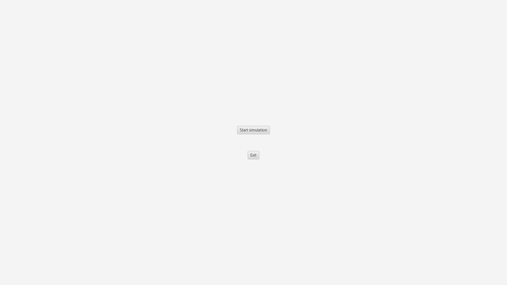
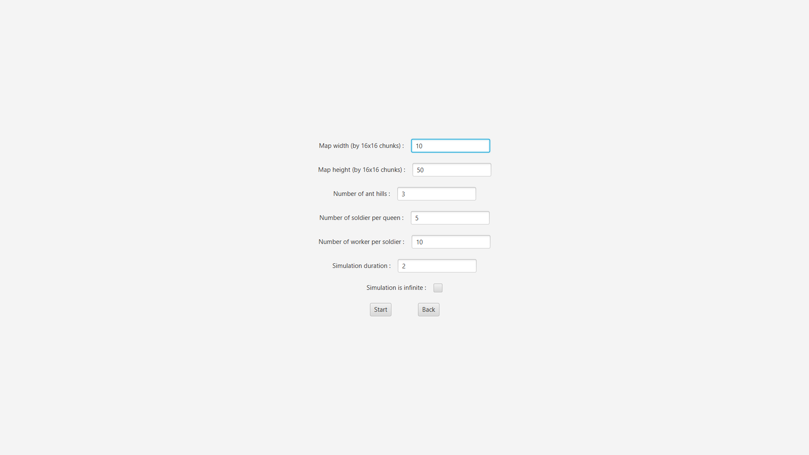
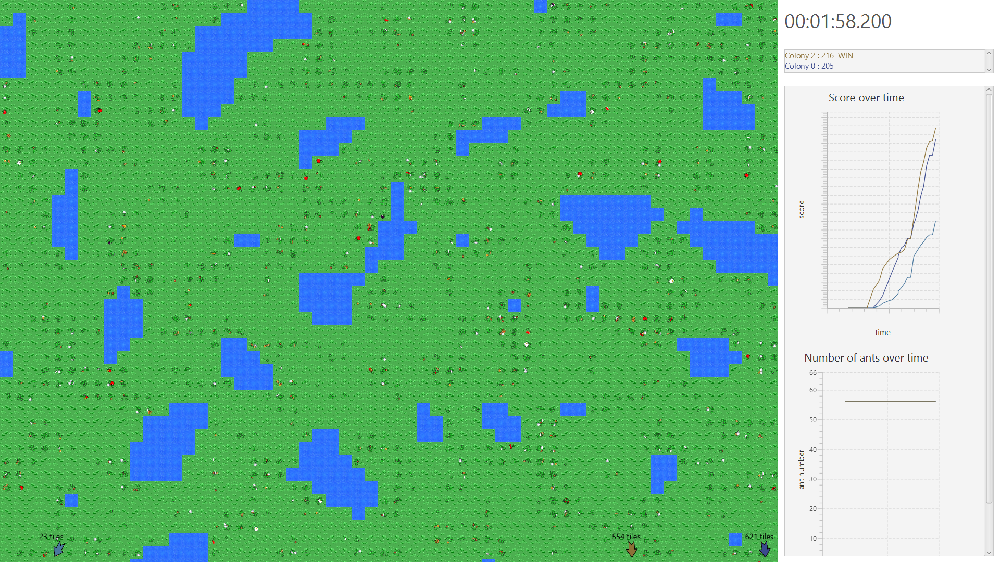

# WELCOME TO ANT WARS !
Hello, ant hero, ant welcome to ant war, the ultimate battle ant simulator.
Here is how this project works, so if you want to know everything about it, read these lines below. 

## Project start
To start this app, you currently have to load the project in your prefered IDE (eclipse, intelliji, noteblock, ...).
This is a maven project, so you should double-check if you updated the project correctly ant installed all dependencies before saying this is gliched and posting 10 issues on github (but I don't judge you).
Then start it as you start a normal project, the main class being the Application class.
An exe / the-exe-verion-for-linux-i-forgot-the-name-of launcher is currently being developped, and will be out soon.

## How to play

### Simulation start
When you launched the project, you should have ended on a page like the one below : 

### Set up the simulation
From there, pressing the exit button will make you .. well .. exit the app.
Pressing the start button however, will bring you to this page : 

From there you can tweek parameters of the simulation, like the size of the map, the number of ants and the simulation duration.
Keep in mind that the map is generated in 16*16 chunks, so don't try to generate a map of 500 by 500 (as an alert should pop out), it would be way too big, instead you should put 32 in width ant height if you want a 500x500 map in average.

### Launch and enjoy !
Then, simply press the start button, and off you go, there are you ants. Have fun watching them evolve and trying to get food for their queen to spawn more of them. Feel free to experiment with the game's mechanics.

#### What's that on my screen ?!
When you launched you simulation, a lot of things shown on screen, as on this screenshot :

On the left, you can see the overall evolution of the simulation. On the top you can see the colonies ranking, with the winner on top.
Just below that, you have 2 graphs, the top one is the evolution of the colonies' score over time, ant the bottom one is the evolution of the number of ants of each colony over time.
On the left side of the screen, you can see the map. Currently there are 3 tipes of tiles, the resources ones, where resources appears, the water ones, which slowly kill the ants, and slow them down, when they walks on it, ant the ant hill tiles, where the queen of each colony stays. 
There are also 3 types of ants : the qeen, the soldiers and the workers, soldiers are basically relays of the queen's signals, and worker are the one gathering resources.
you can see some litle arrows around the map, with a number (a distance) next to them, clicking on them will bring you on an ant hill.

#### Controls
You can do multiple things with the map. By dragging on it, you can move it in all directions. The mouse weel can be used to zoom in ant out on the map. When clicking on the mouse wheel, you can reset the map zoom. If you press control while mouse weeling, you can speed up/down the simulation. pressing control ant the mouse weel button will make the time speed go back to normal. 
Pressing escape will pause the simulation, so you can look at details more easely. On the pause menu you can continue the simulation, step into it, restart a new one or quit to simulation options.
Right clicking on a tile will display its informations, like the ants that are on this tile, the resources on it if there are some, and, when on an ant hill, all the alive ants of the selected colony. By clicking on the "follow" button when viewing the ants on a tile, you can center the said ant on screen ant follow its movements, the yellow line being its path back to home.
Ants release pheromones when traveling back to colony with food, and some ants also send signals to alert others, by pressing tab, you can cicle through different display types showing respectively the pheromones, the signals and the pheromones + the signals.

## Modding
The modding part of this game is being delelopped for now, and will be released as soon as possible.
